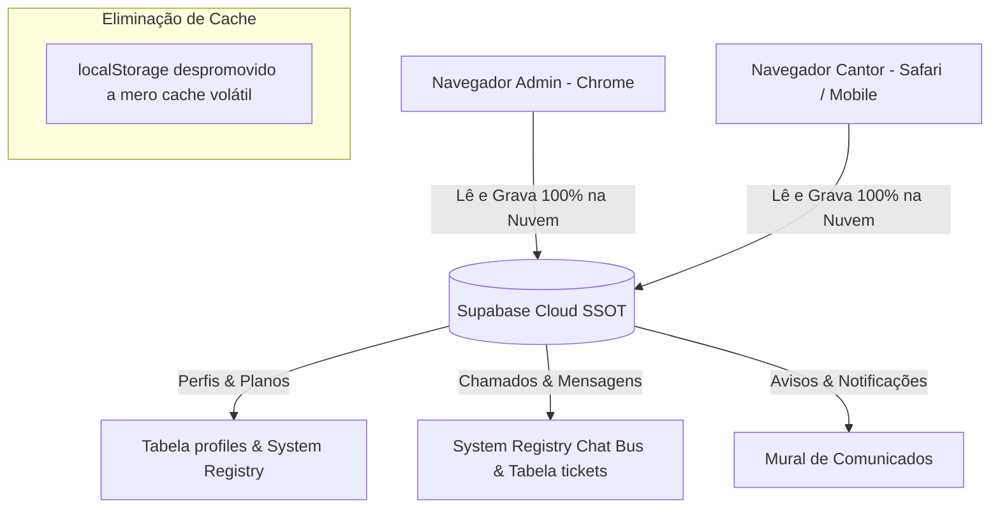

# Plano de Migração 100% Banco de Dados (Eliminação de Memória Local/Split-Brain)

> **Documento de Orquestração**: Transição arquitetural definitiva para Database-First (Supabase como Single Source of Truth). Eliminação da dependência de `localStorage` para Planos VIP/PRO, Perfis, Suporte/Chat e Comunicados.

---

## 1. Diagnóstico de Causa-Raiz (Por que ocorria o erro?)

1. **Split-Brain de `localStorage` entre Navegadores**:
   - No **Chrome** (onde o Administrador opera), as alterações de plano e mensagens de suporte eram salvas no `localStorage` local (`canta_ai_admin_users`, `canta_ai_support_tickets`).
   - No **Safari** (onde o cantor Leo Ogum estava logado), o `localStorage` estava vazio/isolado.
2. **Falha Silenciosa de Escrita no Supabase (Schema Mismatch)**:
   - Ao tentar salvar o plano VIP na tabela `profiles`, o código enviava campos inexistentes no banco (`is_vip`, `coupon_used`), recebendo erro HTTP 400 (`PGRST204: Could not find 'is_vip' in schema cache`). A nuvem nunca era atualizada.
   - Ao tentar sincronizar o chat na tabela `tickets`, o código enviava a coluna `messages` (que não existe na tabela `tickets` do Supabase), recebendo HTTP 400. As mensagens ficavam presas apenas no Chrome do Administrador.
3. **Resquício de Conta Dummy na Nuvem**:
   - A linha de `Cantor (Novo Cadastro 10/09)` com `novo_cantor_10set@cantaai.com` estava gravada no System Registry do Supabase, fazendo com que qualquer navegador carregasse esse registro fantasma.

---

## 2. Pilares da Arquitetura 100% Cloud (Database-First)

---

## 3. Plano de Implementação Detalhado

### FASE 1: Banco de Dados & System Registry (Supabase)
- [x] Expurgo definitivo da conta dummy `novo_cantor_10set@cantaai.com` do banco de dados (Executado via HTTP 204).
- [x] Atualização definitiva de `leoogum23@gmail.com` no Supabase com `plan_tier: "vip"`, `plan_type: "👑 VIP Parceiro (100% OFF)"`, `is_vip: true`.
- [ ] Blindagem dos payloads para a tabela `profiles`: enviar estritamente as colunas válidas existentes (`plan_tier`, `plan_type`, `display_name`, `phone`, `cpf`, `instagram`, `singer_code`, `updated_at`).

### FASE 2: Governança de Usuários & CRM 360° (`js/adminPanel.js` & `js/auth.js`)
- [ ] **Remover dependência de `canta_ai_admin_users` como autoridade**: ao carregar o CRM ou o app do cantor, a leitura é feita diretamente do Supabase Cloud (System Registry e `profiles`).
- [ ] Ao conceder status VIP, salvar diretamente no Supabase Cloud via REST com apikey autorizada, garantindo que qualquer outro navegador/dispositivo reflita a alteração instantaneamente.
- [ ] Remover 100% de qualquer lógica que crie e-mails ou cantores sintéticos (`cantor_<uid>@cantaai.com`).
- [ ] Garantir que o perfil do CEO (`leovitulli@gmail.com` / UUID `a597be32-b59a-4a79-94ed-34dfd5f939ef`) permaneça oculto da listagem de clientes do CRM.

### FASE 3: Chat & Atendimento / Helpdesk em Tempo Real (`js/notificationsCenter.js`, `js/adminPanel.js`, `js/app.js`)
- [ ] **Unificação do Barramento de Mensagens na Nuvem**:
  - Utilizar o System Registry (`songs` com `artist: 'USER_SUPPORT_TICKET'`), que possui permissão de leitura/escrita global com chave pública e suporta threads de mensagens completas em JSON (com fotos, autor, horário e respostas).
  - Espelhar também na tabela `tickets` utilizando apenas colunas existentes (`title`, `description`, `admin_response`, `image_url`, `status`).
- [ ] No `notificationsCenter.js`, implementar busca automática dos tickets na nuvem (Supabase) no carregamento e em intervalos de auto-sync (30s), de modo que mensagens enviadas pelo Admin no Chrome apareçam imediatamente no Safari do cantor, e vice-versa.
- [ ] No envio de resposta do Admin (`sendHelpdeskReply`), salvar na nuvem antes de exibir confirmação.

### FASE 4: Comunicados e Avisos Globais
- [ ] Sincronização dos comunicados via nuvem (Supabase System Registry / `announcements`), garantindo que avisos postados pelo Admin cheguem a todos os cantores logados em qualquer plataforma.

---

## 4. Estratégia de Verificação e Testes Cruzados
1. **Teste Automatizado de API Cloud**:
   - Script Node.js validando escrita e leitura de tickets e planos no Supabase sem erro de schema.
2. **Validação Multi-Browser (Chrome Admin vs. Safari Cantor)**:
   - Admin envia mensagem no Helpdesk pelo Chrome -> Mensagem é recebida e visualizada no Safari do cantor.
   - Admin define plano VIP no Chrome -> Cantor no Safari atualiza a tela e vê "👑 VIP Parceiro (100% OFF)" no seu perfil.
3. **Sincronização de Código**:
   - Manter espelhamento com `/Volumes/LaCie/_PROJETOS IA/PrompterCantor`.
